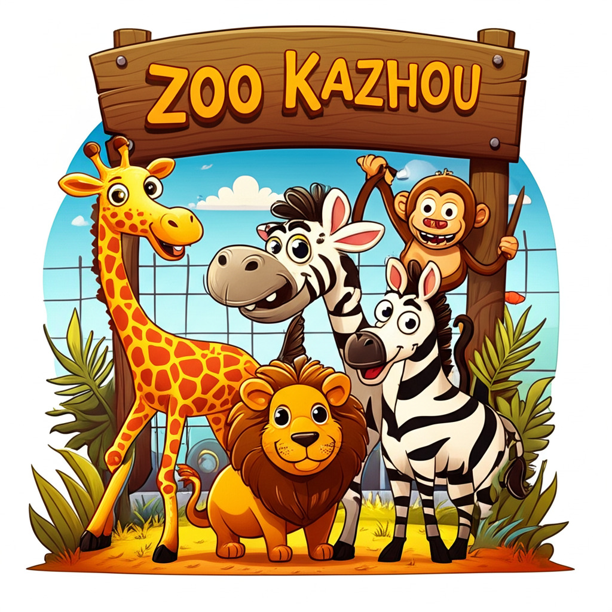

# 🦁 Zoo Kazhou - Sistema de Gerenciamento de Zoológico

  

Sistema de gerenciamento desenvolvido para o Zoo Kazhou, oferecendo uma interface moderna e intuitiva para controle de animais, funcionários e operações diárias do zoológico.

## 🚀 Funcionalidades

### Gerenciamento de Animais
- 🐘 Cadastro e monitoramento de diferentes espécies
- 🏥 Acompanhamento do estado de saúde
- 🏃‍♂️ Controle de atividades físicas
- 🔄 Transferência entre habitats

### Controle de Funcionários
- 👥 Gestão completa da equipe
- 📅 Controle de férias
- ✅ Atribuição de tarefas
- 📊 Monitoramento de atividades

### Operações do Zoológico
- 🕒 Controle de abertura/fechamento
- 👥 Monitoramento de visitantes em tempo real
- 📊 Estatísticas de visitação
- 🔄 Sistema de backup de dados

## 📋 Pré-requisitos

- Java SDK 24 ou superior
- Mínimo 2GB de RAM
- Sistema operacional: Windows/Linux/MacOS

## 🛠️ Tecnologias Utilizadas

- `Java 24`
- `Swing (GUI)`
- `CSV` para armazenamento de dados
- `Padrão MVC`

## 🎯 Princípios de Design

- **SOLID**: Implementação dos princípios SOLID para código sustentável
- **Clean Code**: Código limpo e bem documentado
- **Design Patterns**: Utilização de padrões de projeto
- **MVC**: Arquitetura Model-View-Controller

## 🌟 Agradecimentos

- Professora Marina
- O proprio Zhou
